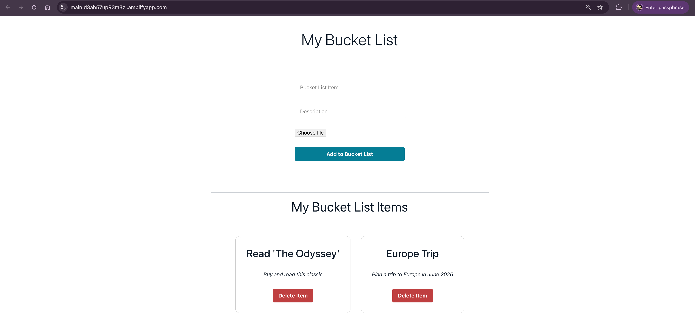

## Bucket List Tracker ☁️

### Overview
This project is a **Bucket List Tracker** application built with **React + Vite** and deployed on AWS Amplify. By building this app, you will learn how to create modern, serverless applications using AWS services.

---

### Steps to Build 👩‍💻
1. **Develop the Application:** Build a bucket list tracker using React.
2. **Version Control:** Initialize a GitHub repository and connect it to your local project.
3. **Frontend Hosting:** Host the frontend on AWS Amplify Hosting.
4. **Authentication:** Use Amplify Studio or Amplify CLI to integrate Amplify Authentication for user login and signup.
5. **API Integration:** Create an AWS AppSync service to build and manage a GraphQL API, and define a GraphQL schema for DynamoDB integration.
6. **Backend Deployment:** Deploy the backend on AWS Amplify to handle data storage and server-side logic.

---

### Services Used 🛠
- **AWS Amplify:** For deploying frontend and backend services.
- **AWS AppSync:** To simplify building and managing scalable GraphQL APIs.
- **GraphQL API:** Allows clients to request only the data they need (API & Schema).
- **DynamoDB:** For storing and managing bucket list items (Database).
- **S3 Bucket:** For storage of user images (Storage).

---

### Architecture Design
Below is the architecture design for the Bucket List Tracker app:

---

### Final App Output
Here is what the final app looks like in action:

